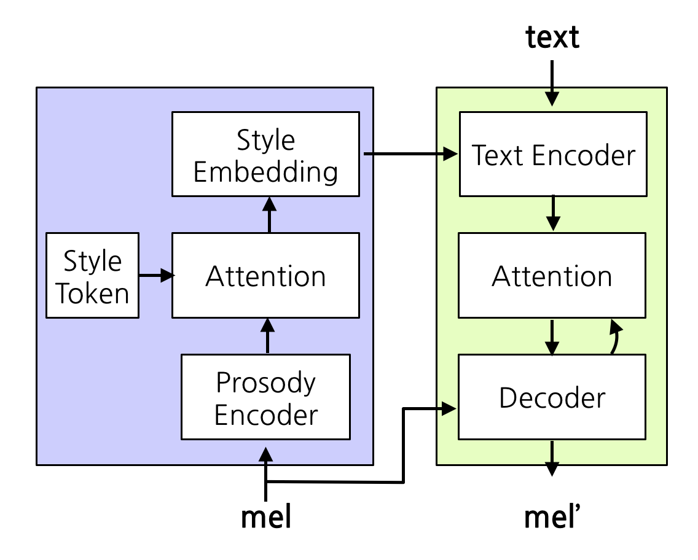
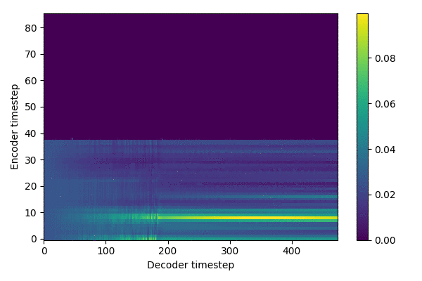

# tacotron2-gst

## Overview


## Data
### Text
    * [KoG2P](https://github.com/scarletcho/KoG2P): Given an input of a series of Korean graphemes/letters (i.e. Hangul), KoG2P outputs the corresponding pronunciations.
    * test: `python -m text.cleaners`
    * examples
    ```
    감정있는 한국어 목소리 생성
     ==>
     ㄱㅏㄻㅈㅓㆁㅇㅣᄔㄴㅡᄔ ㅎㅏᄔㄱㅜㄱㅓ ㅁㅗㄺㅆㅗㄹㅣ ㅅㅐㆁㅅㅓㆁ
     ==>
    ['k0', 'aa', 'mf', 'c0', 'vv', 'ng', 'ii', 'nf', 'nn', 'xx', 'nf', 'zz', 'h0', 'aa', 'nf', 'k0', 'uu', 'k0', 'vv', 'zz', 'mm', 'oo', 'kf', 'ss', 'oo', 'rr', 'ii', 'zz', 's0', 'qq', 'ng', 's0', 'vv', 'ng', '~']
    ==>
    [6, 29, 21, 12, 31, 24, 26, 22, 16, 30, 22, 47, 11, 29, 22, 6, 32, 6, 31, 47, 15, 33, 20, 10, 33, 17, 26, 47, 9, 28, 24, 9, 31, 24, 62] 
    ```
### Audio
    * sampling rate: 22050
    * filter length: 1024
    * hop length: 256
    * win length: 1024
    * n_mel: 80
    * mel_fmin: 0
    * mel_fmax: 8000

### Training files
    * `./filelists/emotiontts_net/*.txt`
    * path | text
    ```
    <yourDataDirPath>/emotiontts_new/01.Main/wav_22k/lmy00600.wav|아날로그와 디지털 장비에 있어 외관의 차이는 거의 없지만 신뢰성이 높으며 빠르고 복잡한 신호까지 포착할 수 있습니다.
    <yourDataDirPath>/emotiontts_new/01.Main/wav_22k/lmy00503.wav|방영 시간은 매주 목요일밤 10시에서 10시 54분까지, 총 12회 방영 예정입니다.
    ```

## Training
1. Prepare Datasets
2. Clone this repo: `git clone <repo>`
3. CD into this repo: `cd tacotron2-gst`
4. Initialize submodule: `git submodule init; git submodule update`
5. Install python requirements: `pip install -r requirements.txt`
6. Training (multi node ver.):
`python3 -m multiproc -u train.py --output_directory=outdir --log_directory=logdir --hparams=distributed_run=True,training_files='filelists/emotiontts_new/emotts_new_train.txt',validation_files='filelists/emotiontts_new/emotts_new_valid.txt',batch_size=6 --network=tacotron2`
7. Monitoring: `tensorboard --logdir=outdir/logdir --host=127.0.0.1`
8. Training results (~ 288,000 steps)

   

## Inference
### Vocoder
- Clone [WaveGlow](https://github.com/NVIDIA/waveglow) as ./waveglow

#### waveglow_cpu_component
- This is WaveGlow modules for the CPU inference version
- Automatically imported when inferencing by CPU

### Inference API daemon (for fast inference)
`python3 inference_daemon.py`

### Entrypoint
`python3 inference.py --predef-style=happy_004 --text="이것은 감정을 담은 목소리입니다."`
    
### Condition on Reference Audio
- Generate voice that follows the style of the reference audio

    Extract style vector from reference audio

    ```python
    outputs, outputs_postnet, _, align = model.inference_by_ref_audio(sequence, ref_audio_mel)
    ```
    
    Generate voice
    ```python
    generate_mels_by_ref_audio(model, waveglow, hparams, sequence, ref_wav, denoiser, 
            denoiser_strength=0.01, device=torch.device('cuda'), *, outpath='output.wav')
    ```

### Condition on Style Tokens
- Generate by style tokens  

    Style token
    ```python
    outputs_by_tokens = model.inference_by_style_tokens(sequence)

    for i, (mel_outputs, mel_outputs_postnet, _, alignments) in enumerate(outputs_by_tokens):
        # do something.
    ```
    
    Generate voice
    ```python
    generate_mels_by_sytle_tokens(model, waveglow, hparams, sequence, denoiser, 
            denoiser_strength=0.01, device=torch.device('cpu'))
    ```

## Samples
- `./res/sample_wav.zip`: condition on reference audio

## References
- Tacotron2: https://github.com/NVIDIA/tacotron2
- GST: https://github.com/KinglittleQ/GST-Tacotron/blob/master/GST.py
- WaveGlow: https://github.com/NVIDIA/waveglow
- Export Images from tfevents: https://github.com/anderskm/exportTensorFlowLog
- Korean tactoron2-gst: https://github.com/jinhan/tacotron2-gst
